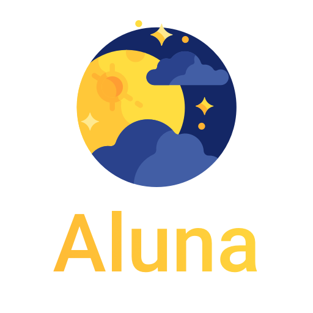

<div align="center">

</div>

<h4 align="center">Fast and easy way to use JDA in your Spring-Boot Project</h4>

<p align="center">
  <a href="https://github.com/viascom/aluna-spring-boot-starter/releases"></a>
  <a href=""></a>
  
  <a href="http://www.apache.org/licenses/"></a>
</p>
<br>

## Version

*These are the versions of all exposed dependencies related to the aluna-spring-boot-starter version.*

| aluna-spring-boot-starter |                                          JDA                                          |                                Spring Boot                                 |                                    Kotlin                                    |                                 emoji-java                                 |
|:--------------------------|:-------------------------------------------------------------------------------------:|:--------------------------------------------------------------------------:|:----------------------------------------------------------------------------:|:--------------------------------------------------------------------------:|
| `1.1.0`                   |  |  |  |  |
| `1.0.0`                   |  |  |    |  |
| `0.0.48_5.0.0-beta.12`    |  |  |  |  |
| `0.0.48_5.0.0-beta.11`    |  |  |  |  |

## Download

Gradle:
```gradle
dependencies {
  implementation 'io.viascom.discord.bot:aluna-spring-boot-starter:1.1.0'
}
```

Maven:
```xml
<dependency>
    <groupId>io.viascom.discord.bot</groupId>
    <artifactId>aluna-spring-boot-starter</artifactId>
    <version>1.1.0</version>
</dependency>
```

## Getting Started

### Create a command

```kotlin
@Interaction
class PingCommand : DiscordCommand("ping", "Send a ping") {
    override fun execute(event: SlashCommandInteractionEvent) {
        event.reply("Pong\nYour locale is:${this.userLocale}").queue()
    }
}
```

### React to a Button

```kotlin
event.reply("Pong\nYour locale is:${this.userLocale}").setComponents(ActionRow.of(primaryButton("hi", "Hi")))
    .queueAndRegisterInteraction(hook, this)


override fun onButtonInteraction(event: ButtonInteractionEvent): Boolean {
    logger.debug(this.hashCode().toString())
    if (event.componentId == "hi") {
        event.editMessage("Oh hi :)").removeActionRows().queue()
    }

    return true
}
```

## Configuration Properties

### Basic configuration example

```yaml
aluna:
  discord:
    token: <insert your token here>

logging:
  level:
    io.viascom.discord.bot.aluna: DEBUG
    io.viascom.discord.bot.aluna.event.EventPublisher: INFO #Set to DEBUG to show all published events
    io.viascom.discord.bot.aluna.bot.handler.AlunaLocalizationFunction: INFO #Set to DEBUG to show translation keys for interactions
```

## Versioning

This project is developed by [Viascom](https://github.com/viascom) using
the [Semantic Versioning specification](https://semver.org). For the versions available, see
the [releases on this repository](https://github.com/viascom/aluna-spring-boot-starter/releases).

## Authors

* **Patrick Bösch** - *Initial work* - [itsmefox](https://github.com/itsmefox)
* **Nikola Stanković** - *Initial work* - [nik-sta](https://github.com/nik-sta)

See also the list of [contributors](https://github.com/viascom/aluna-spring-boot-starter/contributors) who participated
in this project. 💕

## Contributing
See [CONTRIBUTING.md](CONTRIBUTING.md) file.

If you like aluna-spring-boot-starter you can show support by starring ⭐ this repository.

# Licence
[Apache License, Version 2.0, January 2004](http://www.apache.org/licenses/LICENSE-2.0)
